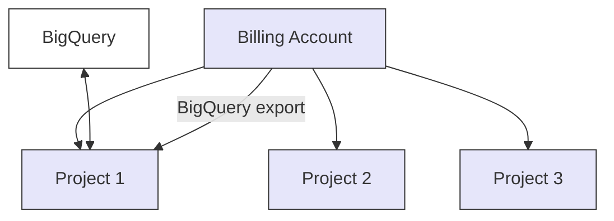

Connect your **GCP account** to Yasu by creating a **Service Account** with the necessary permissions. This connection enables Yasu to analyze your cloud costs and provide optimization recommendations.

For more detailed instructions on creating and managing Service Accounts and IAM roles in GCP, refer to the [official GCP IAM Documentation](https://cloud.google.com/iam/docs/roles-overview).

<iframe
  width="560"
  height="315"
  src="https://www.youtube.com/embed/Sdt-i-Q7tyA"
  title="YouTube video player"
  frameBorder="0"
  allow="accelerometer; autoplay; clipboard-write; encrypted-media; gyroscope; picture-in-picture"
  allowFullScreen
  style={{ width: '100%', borderRadius: '0.5rem', aspectRatio: '16/9' }}
></iframe>

## How the billing structure works in GCP

GCP can be confusing when it comes to billing. To make it a little more clear, you configure your billing export to send the billing data into a project. When you use multiple projects, all billing data will accumulate into one billing account (which exports again to a project → BigQuery).

## Steps to Connect

<Steps>
<Step title="Export billing data to BigQuery">

GCP works with BigQuery to update its price logging every few times a day. To set this up, see the following documentation:

<Card
  title="Export Cloud Billing data to BigQuery"
  icon="book"
  href="https://cloud.google.com/billing/docs/how-to/export-data-bigquery"
>
  Official Google Cloud documentation
</Card>

Or navigate to the [Google Cloud Console Billing page](https://console.cloud.google.com/billing/) and click on **Billing export**. On this page, you can enable the exporting.

<Note>
Make sure billing export is enabled before proceeding to the next steps, as Yasu requires access to BigQuery billing data.
</Note>

</Step>

<Step title="Grant Yasu service account access">

Yasu needs the following **read-only** roles to gather cost, usage, and resource information. The principle of least privilege applies, so attach only what is required.

The service account Yasu uses: `yasu-connector@yasu-437610.iam.gserviceaccount.com`

Grant the following permissions to this service account:

1. **Project Viewer**
   - `roles/viewer` - Provides read access to most project resources, including the ability to list resources.

2. **Billing Viewer**
   - `roles/billing.viewer` - Allows read access to billing account information and cost data.

3. **BigQuery Data Viewer**
   - `roles/bigquery.dataViewer` - Grants read access to BigQuery datasets/tables that hold cost or usage information.

4. **Monitoring Viewer**
   - `roles/monitoring.viewer` - Enables read access to metrics and related monitoring data.

5. **Get the project name**
   - `resourcemanager.projects.get` - Permission to retrieve project information.

</Step>

<Step title="Enable required APIs">

Ensure the following APIs are **enabled** in your GCP project so Yasu can retrieve cost, usage, and metric data:

- **Cloud Billing API**: `cloudbilling.googleapis.com`
- **Cloud Resource Manager API**: `cloudresourcemanager.googleapis.com`
- **BigQuery API**: `bigquery.googleapis.com`
- **Monitoring API**: `monitoring.googleapis.com`

Go to **APIs & Services** → **Library** in the Google Cloud Console and enable each if not already enabled.

</Step>

<Step title="Complete connection in Yasu Dashboard">

1. In Yasu, navigate to **Settings** → **Cloud Accounts** → **Add GCP Account**.
2. Select whether you will **upload the JSON key file** or use **Workload Identity** with an existing service account.
   - **JSON Key**: You'll be prompted to upload your service account's JSON key.
   - **Workload Identity**: Provide the service account email you created above and ensure Yasu's environment is allowed to assume that identity.
3. Click **Connect Account** and wait for verification.

</Step>
</Steps>

## Verification Steps

After connecting, Yasu will perform the following checks:

1. **Service Account Access Validation**
   - Verify that the service account is active and has the expected roles.
   - Confirm the correct JSON key or Workload Identity binding.

2. **Data Collection Vectorizing**
   - Begin collecting **Billing** data (Cost Explorer / BigQuery cost table).
   - Start monitoring **Resource** metrics.
   - Initialize additional analyses based on your enabled APIs.

3. **Parsing Collected Data**
   - The collected data will be converted into Yasu's internal format and stored in the vector database for cost optimization and recommendation generation.

4. **Integration Status**
   - You will see a **green checkmark** when the connection is successful.
   - Optimization recommendations will begin appearing after the initial sync.

<Tip>
**Security Considerations**

- All roles follow the **principle of least privilege**.
- **Read-only** access ensures no modifications to your infrastructure.
- **Key security**: Keep your service account key file in a safe location.
- **All API calls** are logged in your Google Cloud Audit Logs.
- **Data encryption** in transit (TLS 1.2+) and at rest (AES-256).
</Tip>

## Done!

That's it! You have successfully connected your GCP account to Yasu. Once verified, Yasu will start analyzing your GCP billing, resource usage, and performance metrics to provide optimization insights.
