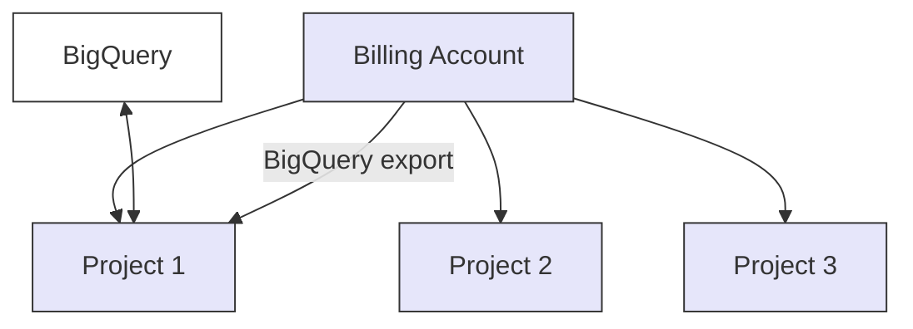

Connect your **GCP account** to Yasu by granting access to Yasu's service account with the necessary permissions. This connection enables Yasu to analyze your cloud costs and provide optimization recommendations.

For more detailed instructions on creating and managing Service Accounts and IAM roles in GCP, refer to the [official GCP IAM Documentation](https://cloud.google.com/iam/docs/roles-overview).

<iframe
  width="560"
  height="315"
  src="https://www.youtube.com/embed/Sdt-i-Q7tyA"
  title="YouTube video player"
  frameBorder="0"
  allow="accelerometer; autoplay; clipboard-write; encrypted-media; gyroscope; picture-in-picture"
  allowFullScreen
  style={{ width: '100%', borderRadius: '0.5rem', aspectRatio: '16/9' }}
></iframe>

## How the billing structure works in GCP

GCP can be confusing when it comes to billing. To make it a little more clear, you configure your billing export to send the billing data into a project. When you use multiple projects, all billing data will accumulate into one billing account (which exports again to a project → BigQuery).



## Steps to Connect

<Steps>
<Step title="Gather required information">

Before starting the connection process, make sure you have the following information ready:

**Required:**
- **GCP Project ID(s)** - The project ID(s) you want Yasu to scan
  - Format: `my-project-id` (not the project number)
  - You can provide multiple project IDs if needed
  - Example: `production-project`, `staging-project`

**Required for Cost Analysis:**
- **Billing Account ID** - Required for accurate cost calculations
  - Format: `01ABCD-2EFGH3-456IJK`
  - Found in: GCP Console → Billing
  - Example: `029B0D-80B502-B17C09`

- **BigQuery Billing Export Dataset** - Required for detailed cost analysis
  - Dataset name where billing export is stored
  - Format: `billing_data` or `billing_export_dataset`
  - This is the BigQuery dataset containing your daily cost data

<Warning>
**Important:** You don't need to create your own service account. Instead, you grant access to Yasu's service account: `yasu-connector@yasu-437610.iam.gserviceaccount.com`
</Warning>

</Step>

<Step title="Export billing data to BigQuery">

GCP works with BigQuery to update its price logging every few times a day. To set this up, see the following documentation:

<Card
  title="Export Cloud Billing data to BigQuery"
  icon="book"
  href="https://cloud.google.com/billing/docs/how-to/export-data-bigquery"
>
  Official Google Cloud documentation
</Card>

Or navigate to the [Google Cloud Console Billing page](https://console.cloud.google.com/billing/) and click on **Billing export**. On this page, you can enable the exporting.

<Note>
Make sure billing export is enabled before proceeding to the next steps, as Yasu requires access to BigQuery billing data.
</Note>

</Step>

<Step title="Grant Yasu service account access">

Yasu needs the following **read-only** roles to gather cost, usage, and resource information. The principle of least privilege applies, so attach only what is required.

**Service Account Email:** `yasu-connector@yasu-437610.iam.gserviceaccount.com`

#### Grant Project-Level Permissions

1. Go to **GCP Console** → **IAM & Admin** → **IAM**
2. Select the project you want to scan
3. Click **"+ GRANT ACCESS"** (or **"+ ADD"**)
4. Under **"New principals"**, add:
   ```
   yasu-connector@yasu-437610.iam.gserviceaccount.com
   ```
5. Under **"Select a role"**, add these roles:
   - ✅ **Viewer** (`roles/viewer`) - Basic read access to project resources
   - ✅ **Compute Viewer** (`roles/compute.viewer`) - For VM scanning
   - ✅ **Cloud SQL Viewer** (`roles/cloudsql.viewer`) - For database scanning
   - ✅ **Kubernetes Engine Viewer** (`roles/container.viewer`) - For GKE scanning
   - ✅ **Storage Object Viewer** (`roles/storage.objectViewer`) - For storage scanning
   - ✅ **Monitoring Viewer** (`roles/monitoring.viewer`) - For utilization metrics
   - ✅ **BigQuery Data Viewer** (`roles/bigquery.dataViewer`) - For BigQuery scanning
   - ✅ **Recommender Viewer** (`roles/recommender.viewer`) - For GCP recommendations
   - ✅ **Billing Account Viewer** (`roles/billing.viewer`) - For cost calculations
   - ✅ **Get the project name** (`resourcemanager.projects.get`) - Permission to retrieve project information
6. Click **"SAVE"**

<Note>
You can grant these permissions at the **Organization** level if you want Yasu to access multiple projects.
</Note>

</Step>

<Step title="Grant BigQuery dataset permissions">

If you have BigQuery billing export configured, you need to grant dataset-level permissions:

1. Go to **GCP Console** → **BigQuery**
2. Select the project that hosts your billing export dataset
3. In the **Explorer** panel, find your billing dataset
4. Click the **three dots (⋮)** next to the dataset name
5. Click **"Share dataset"**
6. Click **"+ ADD PRINCIPAL"**
7. Under **"New principals"**, add:
   ```
   yasu-connector@yasu-437610.iam.gserviceaccount.com
   ```
8. Under **"Select a role"**, select:
   - ✅ **BigQuery Data Viewer** (`roles/bigquery.dataViewer`)
9. Click **"ADD"**

<Warning>
**Important:** Repeat this for each dataset you want Yasu to access.
</Warning>

</Step>

<Step title="Enable required APIs">

You must enable the following Google Cloud APIs in **each project** you want Yasu to scan.

#### Core APIs (Required for All Scans)

Enable these APIs in every project:

1. ✅ **Cloud Resource Manager API**
   - API Name: `cloudresourcemanager.googleapis.com`
   - Provides project information and access control

2. ✅ **Cloud Billing API**
   - API Name: `cloudbilling.googleapis.com`
   - **Critical:** Needed for cost calculations

3. ✅ **Cloud Monitoring API**
   - API Name: `monitoring.googleapis.com`
   - **Critical:** Needed for utilization metrics

4. ✅ **BigQuery API**
   - API Name: `bigquery.googleapis.com`
   - Required for accessing billing export data

#### Service-Specific APIs

Enable these APIs **only if** you use these services:

5. ✅ **Compute Engine API** (if you have VMs)
   - API Name: `compute.googleapis.com`
   - Required for: VM scanning, disk scanning, IP scanning

6. ✅ **Cloud SQL Admin API** (if you have Cloud SQL databases)
   - API Name: `sqladmin.googleapis.com`
   - **Note:** This API is **NOT enabled by default** - you must enable it manually

7. ✅ **Kubernetes Engine API** (if you have GKE clusters)
   - API Name: `container.googleapis.com`
   - **Note:** This API is **NOT enabled by default** - you must enable it manually

8. ✅ **BigQuery Reservation API** (if you use BigQuery slot commitments)
   - API Name: `bigqueryreservation.googleapis.com`
   - **Note:** This API is **NOT enabled by default** - you must enable it manually

9. ✅ **Cloud Storage API** (if you use Cloud Storage)
   - API Name: `storage.googleapis.com`
   - Usually enabled by default

10. ✅ **Recommender API** (for GCP native recommendations)
    - API Name: `recommender.googleapis.com`

#### How to Enable APIs

**Option 1: Using GCP Console (Easiest)**
1. Go to **APIs & Services** → **Library**
2. Search for the API name (e.g., "Compute Engine API")
3. Click on the API
4. Click **"Enable"**
5. Repeat for all APIs listed above

**Option 2: Using gcloud Command**
```bash
# Replace PROJECT_ID with your actual project ID
gcloud services enable compute.googleapis.com --project=PROJECT_ID
gcloud services enable sqladmin.googleapis.com --project=PROJECT_ID
gcloud services enable container.googleapis.com --project=PROJECT_ID
gcloud services enable bigqueryreservation.googleapis.com --project=PROJECT_ID
gcloud services enable cloudbilling.googleapis.com --project=PROJECT_ID
gcloud services enable monitoring.googleapis.com --project=PROJECT_ID
gcloud services enable recommender.googleapis.com --project=PROJECT_ID
gcloud services enable cloudresourcemanager.googleapis.com --project=PROJECT_ID
gcloud services enable bigquery.googleapis.com --project=PROJECT_ID
```

<Warning>
**Important:** After enabling APIs, wait **1-2 minutes** before connecting in Yasu.
</Warning>

</Step>

<Step title="Verify project requirements">

Your projects must meet these requirements before connecting:

- ✅ **Projects must be active** (not deleted or suspended)
- ✅ **Billing must be enabled** (for accurate cost calculations)
- ✅ **Projects should have resources** (empty projects will show 0 results)

</Step>

<Step title="Complete connection in Yasu Dashboard">

1. In Yasu, navigate to **Settings** → **Cloud Accounts** → **Add GCP Account**.
2. **Enter your information:**
   - Project ID (hosting BigQuery billing dataset)
   - Billing Account ID
   - BigQuery Dataset Name (billing export dataset)
3. Select whether you will **upload the JSON key file** or use **Workload Identity** with an existing service account.
   - **JSON Key**: You'll be prompted to upload your service account's JSON key.
   - **Workload Identity**: Provide the service account email you created above and ensure Yasu's environment is allowed to assume that identity.
4. Click **Connect Account** and wait for verification.

Yasu will verify:
- Service account has required permissions
- APIs are enabled
- BigQuery dataset is accessible
- Billing information is available

</Step>
</Steps>

## What We Will Scan

Once configured, Yasu will scan your GCP environment for:

### Cost Optimization Opportunities

1. **Idle VM Instances** - VMs that are running but not being used
2. **Over-Sized VMs** - VMs that can be downsized to save costs
3. **Unattached Disks** - Disks not connected to any VM
4. **Unused IP Addresses** - Static IPs not being used
5. **Unused Storage Buckets** - Cloud Storage buckets with no activity
6. **Underutilized BigQuery Slots** - BigQuery commitments not fully used
7. **GKE Cluster Optimization** - Kubernetes clusters that can be optimized
8. **Idle Cloud SQL Databases** - Database instances with no activity

### GCP Native Recommendations

We also pull recommendations directly from Google's Recommender API for additional insights.

## Verification Steps

After connecting, Yasu will perform the following checks:

1. **Service Account Access Validation**
   - Verifies Yasu's service account has the expected roles
   - Confirms access to your projects
   - Verifies the correct JSON key or Workload Identity binding

2. **API Availability Check**
   - Verifies all required APIs are enabled
   - Tests API connectivity

3. **Data Collection Vectorizing**
   - Begins collecting **Billing** data (Cost Explorer / BigQuery cost table)
   - Starts monitoring **Resource** metrics
   - Initializes additional analyses based on your enabled APIs

4. **Parsing Collected Data**
   - The collected data will be converted into Yasu's internal format and stored in the vector database for cost optimization and recommendation generation

5. **Integration Status**
   - You will see a **green checkmark** when the connection is successful
   - Optimization recommendations will begin appearing after the initial sync (usually within a few minutes)

## Common Issues and Quick Fixes

<AccordionGroup>
<Accordion title='Issue: "API not enabled" Error'>

**What it means:** An API we need is not enabled in your project.

**Fix:**
1. Go to **APIs & Services** → **Library**
2. Search for the API mentioned in the error
3. Click **"Enable"**
4. Wait 1-2 minutes
5. Try connecting again in Yasu

</Accordion>

<Accordion title='Issue: "Permission denied" Error'>

**What it means:** Yasu's service account doesn't have the required permissions.

**Fix:**
1. Go to **IAM & Admin** → **IAM**
2. Find `yasu-connector@yasu-437610.iam.gserviceaccount.com`
3. Make sure it has all the roles listed in Step 3 above
4. If missing, add the required role
5. Try connecting again

</Accordion>

<Accordion title='Issue: "BigQuery dataset not accessible"'>

**What it means:** Yasu's service account can't access your BigQuery billing dataset.

**Fix:**
1. Go to **BigQuery** → Select your billing dataset
2. Click **three dots (⋮)** → **"Share dataset"**
3. Add `yasu-connector@yasu-437610.iam.gserviceaccount.com`
4. Grant **BigQuery Data Viewer** role
5. Click **"ADD"**
6. Try connecting again

</Accordion>

<Accordion title='Issue: "No resources found"'>

**What it means:** Either:
- Your project has no resources (this is normal), OR
- Resources are in a different project

**Fix:**
- Verify you provided the correct project ID
- Check if resources exist in the project
- If resources exist but aren't found, contact support

</Accordion>
</AccordionGroup>

## Security and Privacy

<Tip>
**Security Considerations**

- ✅ **Read-Only Access:** Yasu's service account only has read permissions - we cannot modify or delete your resources
- ✅ **Secure Access:** Access is controlled through IAM roles you grant
- ✅ **No Data Sharing:** We do not share your data with third parties
- ✅ **You Control Access:** You can revoke access at any time by removing IAM roles from Yasu's service account
- ✅ **All roles follow the principle of least privilege**
- ✅ **Key security:** Keep your service account key file in a safe location
- ✅ **All API calls** are logged in your Google Cloud Audit Logs
- ✅ **Data encryption** in transit (TLS 1.2+) and at rest (AES-256)
</Tip>

## Done!

That's it! You have successfully connected your GCP account to Yasu. Once verified, Yasu will start analyzing your GCP billing, resource usage, and performance metrics to provide optimization insights.
