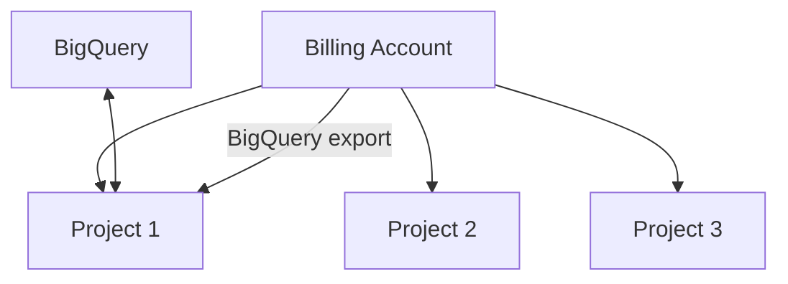

Connect your **GCP account** to Yasu by granting access to Yasu's service account with the necessary permissions. This connection enables Yasu to analyze your cloud costs and provide optimization recommendations.

For more detailed instructions on creating and managing Service Accounts and IAM roles in GCP, refer to the [official GCP IAM Documentation](https://cloud.google.com/iam/docs/roles-overview).

<iframe
  width="560"
  height="315"
  src="https://www.youtube.com/embed/Sdt-i-Q7tyA"
  title="YouTube video player"
  frameBorder="0"
  allow="accelerometer; autoplay; clipboard-write; encrypted-media; gyroscope; picture-in-picture"
  allowFullScreen
  style={{ width: '100%', borderRadius: '0.5rem', aspectRatio: '16/9' }}
></iframe>

## How the billing structure works in GCP

GCP can be confusing when it comes to billing. To make it a little more clear, you configure your billing export to send the billing data into a project. When you use multiple projects, all billing data will accumulate into one billing account (which exports again to a project → BigQuery).


```mermaid
flowchart TD
    BA[Billing Account] --> P1[Project 1]
    BA --> P2[Project 2]
    BA --> P3[Project 3]

    BQ[BigQuery] <--> P1

    BA -- "BigQuery export" --> P1
```

## Steps to Connect

<Steps>
<Step title="Gather required information">

Before starting the connection process, make sure you have the following information ready:

**Required:**
- **GCP Project ID** - The project ID that hosts your BigQuery billing export dataset
  - Format: `my-project-id` (not the project number)
  - For **Organization scope**, Yasu auto-discovers all projects in the organization

**Required for Cost Analysis:**
- **Billing Account ID** - Required for accurate cost calculations
  - Format: `01ABCD-2EFGH3-456IJK`
  - Found in: GCP Console → Billing
  - Example: `029B0D-80B502-B17C09`

- **BigQuery Billing Export Dataset** - Required for detailed cost analysis
  - Dataset name where billing export is stored
  - Format: `billing_data` or `billing_export_dataset`
  - This is the BigQuery dataset containing your daily cost data

<Warning>
**Important:** You don't need to create your own service account. Instead, you grant access to Yasu's service account: `yasu-connector@yasu-437610.iam.gserviceaccount.com`
</Warning>

</Step>

<Step title="Export billing data to BigQuery">

GCP works with BigQuery to update its price logging every few times a day. To set this up, see the following documentation:

<Card
  title="Export Cloud Billing data to BigQuery"
  icon="book"
  href="https://cloud.google.com/billing/docs/how-to/export-data-bigquery"
>
  Official Google Cloud documentation
</Card>

Or navigate to the [Google Cloud Console Billing page](https://console.cloud.google.com/billing/) and click on **Billing export**. On this page, you can enable the exporting.

<Note>
Make sure billing export is enabled before proceeding to the next steps, as Yasu requires access to BigQuery billing data.
</Note>

</Step>

<Step title="Grant Yasu service account access">

Yasu needs the following **read-only** roles to gather cost, usage, and resource information. The principle of least privilege applies, so attach only what is required.

**Service Account Email:** `yasu-connector@yasu-437610.iam.gserviceaccount.com`

#### Grant Project-Level Permissions

1. Go to **GCP Console** → **IAM & Admin** → **IAM**
2. Select the project you want to scan
3. Click **"+ GRANT ACCESS"** (or **"+ ADD"**)
4. Under **"New principals"**, add:
   ```
   yasu-connector@yasu-437610.iam.gserviceaccount.com
   ```
5. Under **"Select a role"**, add these roles:
   - ✅ **Viewer** (`roles/viewer`) - Basic read access to project resources (covers Compute, Cloud SQL, GKE, and Monitoring read permissions)
   - ✅ **Browser** (`roles/browser`) - Read access to browse the project hierarchy
   - ✅ **Storage Object Viewer** (`roles/storage.objectViewer`) - For storage scanning (not included in Viewer)
   - ✅ **BigQuery Data Viewer** (`roles/bigquery.dataViewer`) - For BigQuery scanning
   - ✅ **BigQuery Job User** (`roles/bigquery.jobUser`) - For running BigQuery billing queries
   - ✅ **Recommender Viewer** (`roles/recommender.viewer`) - For GCP recommendations
   - ✅ **Billing Account Viewer** (`roles/billing.viewer`) - For cost calculations
6. Click **"SAVE"**

#### Organization-Level Permissions (for org scope only)

If you selected **Organization scope** in Yasu, grant these **additional** roles at the **organization level** (not project level):

1. Go to **GCP Console** → **IAM & Admin** → **IAM**
2. Switch to your **Organization** (top of the page)
3. Click **"+ GRANT ACCESS"**
4. Add `yasu-connector@yasu-437610.iam.gserviceaccount.com`
5. Add the role:
   - ✅ **Browser** (`roles/browser`) - Allows Yasu to discover all projects in your organization

<Note>
For organization scope, you still need to grant the project-level roles above on **each project** you want scanned (or use [IAM policy inheritance](https://cloud.google.com/iam/docs/granting-changing-revoking-access) by granting them at the org/folder level).
</Note>

</Step>

<Step title="Grant BigQuery dataset permissions">

If you have BigQuery billing export configured, you need to grant dataset-level permissions:

1. Go to **GCP Console** → **BigQuery**
2. Select the project that hosts your billing export dataset
3. In the **Explorer** panel, find your billing dataset
4. Click the **three dots (⋮)** next to the dataset name
5. Click **"Share dataset"**
6. Click **"+ ADD PRINCIPAL"**
7. Under **"New principals"**, add:
   ```
   yasu-connector@yasu-437610.iam.gserviceaccount.com
   ```
8. Under **"Select a role"**, select:
   - ✅ **BigQuery Data Viewer** (`roles/bigquery.dataViewer`)
9. Click **"ADD"**

<Warning>
**Important:** Repeat this for each dataset you want Yasu to access.
</Warning>

</Step>

<Step title="Verify project requirements">

Your projects must meet these requirements before connecting:

- ✅ **Projects must be active** (not deleted or suspended)
- ✅ **Billing must be enabled** (for accurate cost calculations)
- ✅ **Projects should have resources** (empty projects will show 0 results)

</Step>

<Step title="Complete connection in Yasu Dashboard">

1. In Yasu, navigate to **Settings** → **Cloud Accounts** → **Add GCP Account** and click **Connect**.
2. **Step 1 — Scope**: Select **Project** (single project) or **Organization** (all projects in an org). For organization scope, enter your Organization ID.
3. **Step 2 — Billing**: Enter your **Billing Account ID** and **BigQuery Dataset ID** (format: `project-id.dataset_name`).
4. **Step 3 — Connect**: Verify the required roles are granted to Yasu's service account, then click **Connect**.

Yasu will automatically verify:
- Service account has the required permissions
- Required APIs are enabled
- BigQuery dataset is accessible
- Billing information is available

</Step>
</Steps>

## Verification Steps

After connecting, Yasu will perform the following checks:

1. **Service Account Access Validation**
   - Verifies Yasu's service account has the expected roles
   - Confirms access to your projects
   - Verifies the correct JSON key or Workload Identity binding

2. **Data Collection**
   - Begins collecting **Billing** data from BigQuery
   - Starts monitoring **Resource** metrics

3. **Parsing Collected Data**
   - The collected data will be converted into Yasu's internal format for cost optimization and recommendation generation

4. **Integration Status**
   - You will see a **green checkmark** when the connection is successful
   - Optimization recommendations will begin appearing after the initial sync (usually within a few minutes)

## Common Issues and Quick Fixes

<AccordionGroup>
<Accordion title='Issue: "API not enabled" Error'>

**What it means:** An API we need is not enabled in your project.

**Fix:**
1. Go to **APIs & Services** → **Library**
2. Search for the API mentioned in the error
3. Click **"Enable"**
4. Wait 1-2 minutes
5. Try connecting again in Yasu

</Accordion>

<Accordion title='Issue: "Permission denied" Error'>

**What it means:** Yasu's service account doesn't have the required permissions.

**Fix:**
1. Go to **IAM & Admin** → **IAM**
2. Find `yasu-connector@yasu-437610.iam.gserviceaccount.com`
3. Make sure it has all the roles listed in Step 3 above
4. If missing, add the required role
5. Try connecting again

</Accordion>

<Accordion title='Issue: "BigQuery dataset not accessible"'>

**What it means:** Yasu's service account can't access your BigQuery billing dataset.

**Fix:**
1. Go to **BigQuery** → Select your billing dataset
2. Click **three dots (⋮)** → **"Share dataset"**
3. Add `yasu-connector@yasu-437610.iam.gserviceaccount.com`
4. Grant **BigQuery Data Viewer** role
5. Click **"ADD"**
6. Try connecting again

</Accordion>

<Accordion title='Issue: "No resources found"'>

**What it means:** Either:
- Your project has no resources (this is normal), OR
- Resources are in a different project

**Fix:**
- Verify you provided the correct project ID
- Check if resources exist in the project
- If resources exist but aren't found, contact support

</Accordion>
</AccordionGroup>

## Security and Privacy

<Tip>
**Security Considerations**

- ✅ **Read-Only Access:** Yasu's service account only has read permissions - we cannot modify or delete your resources
- ✅ **Secure Access:** Access is controlled through IAM roles you grant
- ✅ **No Data Sharing:** We do not share your data with third parties
- ✅ **You Control Access:** You can revoke access at any time by removing IAM roles from Yasu's service account
- ✅ **All roles follow the principle of least privilege**
- ✅ **Key security:** Keep your service account key file in a safe location
- ✅ **All API calls** are logged in your Google Cloud Audit Logs
- ✅ **Data encryption** in transit (TLS 1.2+) and at rest (AES-256)
</Tip>

## Done!

That's it! You have successfully connected your GCP account to Yasu. Once verified, Yasu will start analyzing your GCP billing, resource usage, and performance metrics to provide optimization insights.
