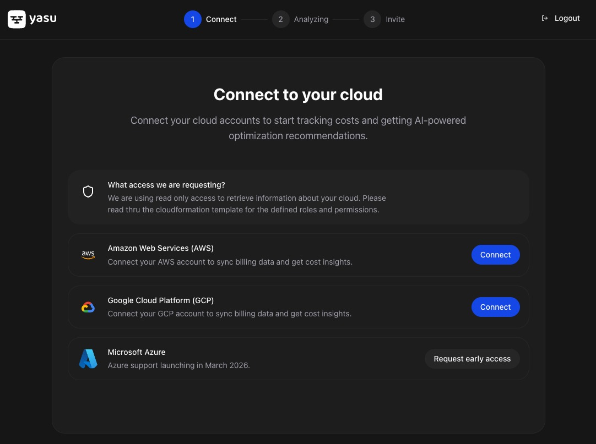
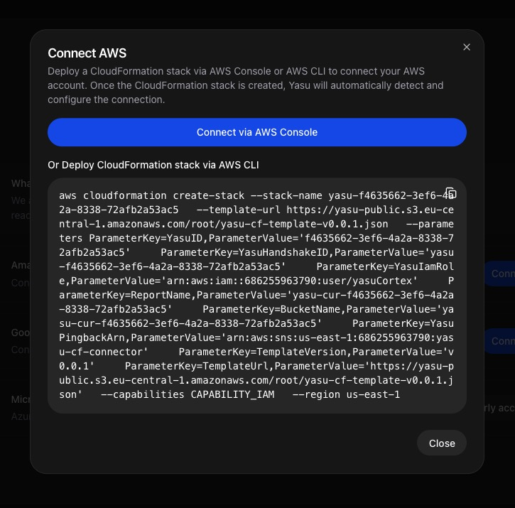
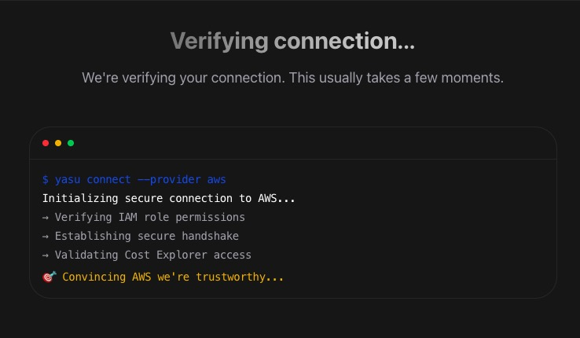
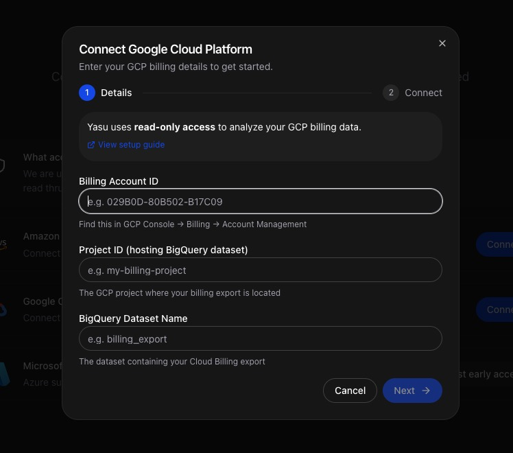
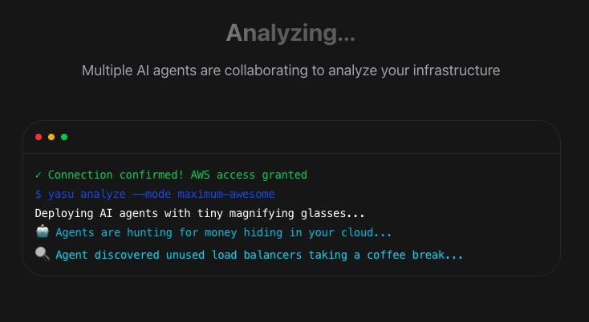
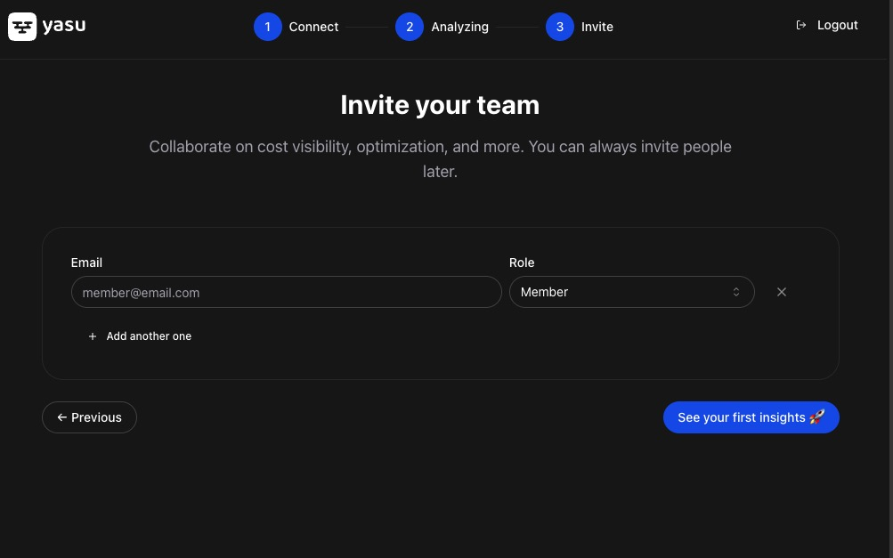
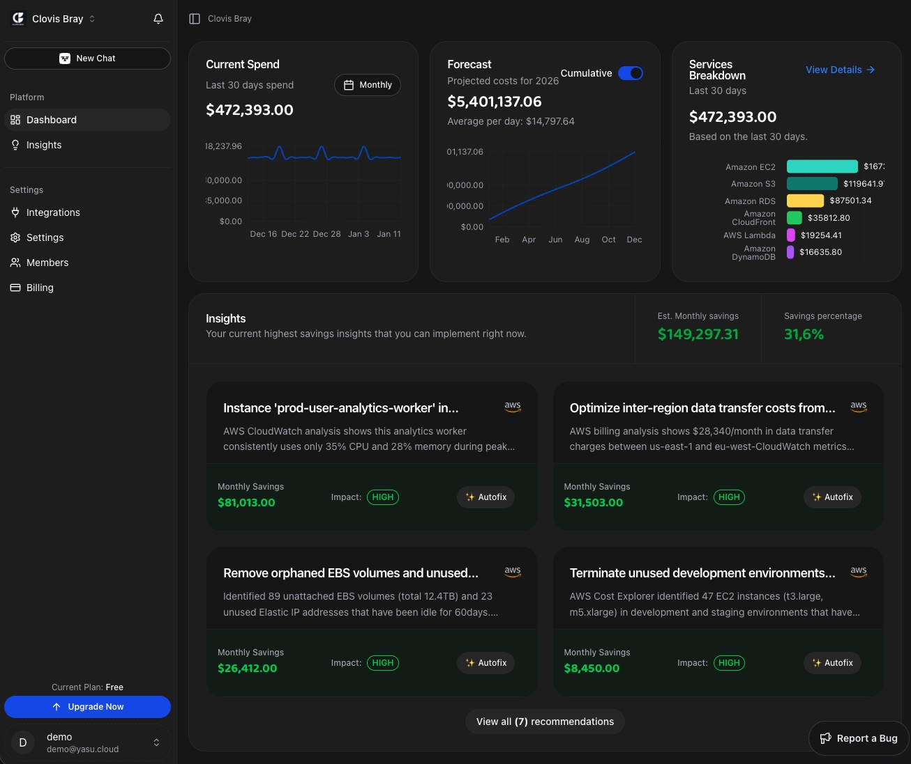

## Get started in five steps

Connect your cloud accounts and start receiving cost-saving insights right away.

<Steps>
  <Step title="Create your account">
    Sign up for Yasu at [app.yasu.cloud/auth/sign-up](https://app.yasu.cloud/auth/sign-up).

    You can sign up with your email or use Google/GitHub SSO for faster onboarding.

    After signing up, you'll be prompted to create your first **workspace**. A workspace is where your team collaborates on cloud cost optimization.
  </Step>

  <Step title="Connect your cloud account">
    Select your cloud provider to start analyzing your costs.

    

    <Tabs>
      <Tab title="AWS">
        **Connect AWS via CloudFormation**

        Click **Connect AWS** and you'll be redirected to AWS CloudFormation with our template pre-loaded.

        

        1. Review the stack name and parameters (pre-filled for you)
        2. Scroll to the bottom and check the acknowledgment box
        3. Click **Create Stack**

        <Info>
        Yasu uses **read-only access** to analyze your AWS costs and resources. We never make changes to your infrastructure.
        </Info>

        **Verify the connection**

        Once the CloudFormation stack completes, Yasu automatically detects the connection. You'll see the verification screen:

        

        The CloudFormation template creates an IAM role with permissions to:
        - Read Cost Explorer data
        - List resources across services
        - Access CloudWatch metrics
      </Tab>

      <Tab title="GCP">
        **Connect GCP via OAuth**

        Click **Connect GCP** to start the OAuth flow.

        

        1. Sign in with your Google account that has access to the GCP project
        2. Select the project(s) you want to connect
        3. Grant the required permissions

        <Info>
        Yasu requests **read-only access** to your GCP billing and resource data. We never make changes to your infrastructure.
        </Info>

        Yasu will request access to:
        - Billing account data
        - Project resource information
        - Compute and storage metrics
      </Tab>
    </Tabs>
  </Step>

  <Step title="Start your AI agents">
    After connecting your cloud account, configure which AI agents you want to activate. These agents continuously analyze your infrastructure for cost-saving opportunities.

    

    Select the agents that match your optimization goals:
    - **Cost Analyzer** — Identifies idle and underutilized resources
    - **Right-Sizing Agent** — Recommends optimal instance sizes
    - **Reserved Instance Advisor** — Finds RI and Savings Plan opportunities

    <Tip>You can enable or disable agents at any time from Settings.</Tip>
  </Step>

  <Step title="Invite your team">
    Collaborate with your team by inviting members to your workspace.

    

    Enter email addresses of team members you want to invite. They'll receive an invitation to join your Yasu workspace.

    <Info>
    You can manage team members and permissions later from **Settings** → **Members**.
    </Info>
  </Step>

  <Step title="See your insights">
    Once setup is complete, you'll land on your dashboard where cost-saving insights start appearing.

    

    Your dashboard shows:
    - **Current spend** — Real-time cloud cost tracking
    - **Quick Wins** — AI-powered savings recommendations
    - **Forecast** — Predicted costs for the coming month
    - **Services breakdown** — Costs by cloud service

    <Check>
    Most users see their first cost-saving recommendations within **5 minutes** of connecting.
    </Check>
  </Step>
</Steps>

## Next steps

<CardGroup cols={2}>

<Card title="Explore the Dashboard" icon="chart-line" href="/dashboard">
  Understand your cost breakdown and spending trends.
</Card>

<Card title="Review Quick Wins" icon="lightbulb" href="/insights">
  See AI-powered recommendations and implement savings.
</Card>

<Card title="Set up Shift-Left" icon="code-pull-request" href="/shift-left">
  Catch costly mistakes before they reach production.
</Card>

<Card title="Connect Slack" icon="slack" href="/integrations/slack">
  Get notifications about savings opportunities in Slack.
</Card>

</CardGroup>

<Note>
  **Need help?** Contact us at support@yasu.cloud or use the chat widget in the app.
</Note>
